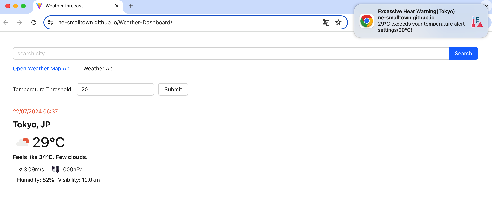

# Weather Dashboard

This is the repo of the Code Challenge of Rehasaku.

## Getting started

### Installation

Clone the repository
```shell
git clone https://github.com/NE-SmallTown/Weather-Dashboard.git
```

Switch to the repo folder
```shell
cd Weather-Dashboard
```

Install dependencies
```shell
npm install
```

### Start application

As I have deployed it using GitHub Actions. You can open https://ne-smalltown.github.io/Weather-Dashboard to view the application in your browsers.

> But also, if you want to play it on your local computer, you can start it by doing the following commands:
> - `npm run dev`
> - Open `http://localhost:5173/Weather-Dashboard` in your browser

## Environment Requirement

- Node.js 18+


## Explanation of the implementation

### Design concepts and specifications

#### Phase 1: Prototype Development: 

At this stage, since it has only one weather API needed to consider, we can just do it simple. We fetch the weather info
in `App.tsx` and render it in `WeatherInfoPanel.tsx`. They are coupled.

#### Phase 2: Phase 2: Feature Expansion:

Now, given that we need to support multiple weather APIs, we need to refactor all what we did to make the application decoupled and extensible.

1. We abstract a request util(`createApi`) to make us be able to create different request utils depending on their hosts by calling `const openWeatherMapApi = createApi(API_HOST_OPEN_WEATHER_MAP)` and `const weatherApi = createApi(API_HOST_WEATHER_API)`.

2. We abstract a unified typescript interface(`UnifiedWeatherInfo`) to unify API responses from different weather API sources.
   Then, we change `WeatherInfoPanel.tsx` to render weather info based on the interface of `UnifiedWeatherInfo` instead of some specific interfaces like `OpenWeatherMapWeatherInfo`, which was what we did in Phase 1.

3. Then, we implement an abstract layer(a React hook named `useTabItem`) to let us can integrate 2 or more different weather APIs without changing `App.tsx` or `WeatherInfoPanel.tsx`.
   Every time we want to add a new weather API source, we just create a new hook by calling `const useNewApiTabItem = () => useTabItem({ tabLabel: 'New weather API name', fetchWeatherInfoCallback: ... });`.
   And in `fetchWeatherInfoCallback`, we define how to fetch the weather info and how to convert its data structure to match `UnifiedWeatherInfo`.
   Then, this new tab item will be automatically added to the tabs of all weather API sources that users can choose from. 
   By doing so, we just need to add a new hook, we don't need to modify/change any other existing codes, which helps us expand the application easily and safely.

#### Phase 3: Weather Alerts

We use service workers to implement a weather alert system that notifies users when the temperature threshold set by users are met.

1. On the main thread side, we request the Web Notification permission and register our `service_worker.js`.
   Then, when users set a temperature threshold of a place, we send this threshold with other information to the service worker by calling `navigator.serviceWorker.controller.postMessage`.

2. On the service worker side, we set a listener for listening to messages sent from the main thread about if users has set a temperature threshold. 
   If yes, it will start to fetch the related weather info to check if the current temperature of that place exceeds the temperature threshold.
   If yes, we send messages back to the main thread to send notifications.

3. On the main thread side, when it receives messages to let it send notifications, it will call the Web Notification API(`new Notification({ icon, body })`) to notify users about the weather alerts.

### Environment setup and deployment instructions.

No actions needed. It will be automatically deployed to https://ne-smalltown.github.io/Weather-Dashboard when a PR(pull request) is merged to the master branch.

> If you want to run it on your local computer, just make sure your node version is 18+

## Screenshots



